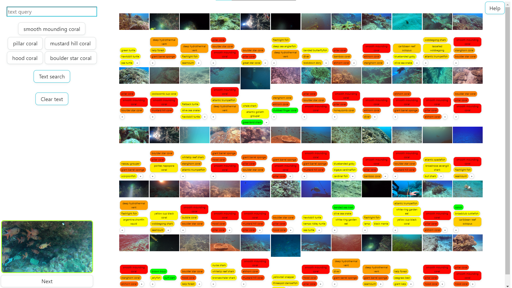

# GASearcher

GASearcher is a search engine that utilizes a neural network CLIP to process and retrieve images. The data is
loaded from [the models file](gas/models.py) upon server startup.

Searching through datasets is performed by querying [the server](gas/view.py).

All user interface data is separated into [html](templates), [css](static/css)
a [javascript](static/js) files.


## Requirements

* Python 3
* pip package manager

## Installation

1. Clone the repository.

    ```commandline
    git clone git@gitlab.mff.cuni.cz:vopalkoz/term-project.git
    ```

2. To run whole project, including the virtual environment and required Python libraries,
   use [start_server.bat](start_server.bat) for Windows or [start_server](start_server.sh) for Linux.
   For repeated start of project is possible used only this command:
   ```commandline
   python manage.py runserver
   ```

3. Open your web browser and go to http://localhost:8000/ to access the GASearcher. It is recommended to use Microsoft
   Edge or Google Chrome, but it is essential to enable cookies for proper functioning.

In case the error occurs when starting the server itself, try running the `python manage.py migrate` command first and
then try to start the server again using `python manage.py runserver`.

## Using

Once you have the GASearcher running, you can use it to search in sample image dataset using text queries.

To search using text (the interface can be seen in the picture below):

1. Enter a query in the text search box and click "Search" or "Enter".
2. The results will be displayed along with their classes.
3. To view context of a specific image in the video, click on its thumbnail.



More information about using searcher is shown on welcome page.

Both similarity search and shifting in context are enabled after downloading of software. These settings can be changed
in [the config file](static/js/config.js). Similarly, the number of frames displayed and the option to use a model that
combines the previous and current query can be set in [settings](gas/settings.py) along with adjusting the config file.

## Sample dataset

For first try of software project contains small sample dataset (with preprocessed data). In addition, this dataset
contains very similar images, so it is more for test runs to show functionality than anything else.


